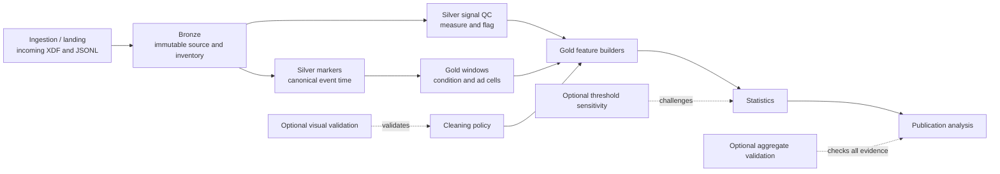

# EEG preprocessing: executable trace and data transformations

Date: 4 August 2026

## Purpose

This is the durable Markdown companion to the interactive EEG pipeline canvas.
It explains what the current code actually executes, the input and output data
formats, the distinction between quality control and cleaning, and the current
scientific gates. It is intended to make the preprocessing pipeline auditable
without relying on chat history or treating the implementation as a black box.

The interactive source is:

`/home/wtroi/.cursor/projects/home-wtroi-MasterThesis-RAG-RecSys/canvases/eeg-pipeline-explainer.canvas.tsx`

The maintained publication diagram is:

`src/project/docs/eeg_pipeline/eeg_pipeline.png`

The canvas is the detailed interactive explanation. This document is its
durable, version-controlled context representation.

## One-sentence mental model

`Bronze preserves evidence → Silver establishes trustworthy time and signal
rules → Gold constructs analysis cells and numerical features → Analysis tests
participant-level contrasts and generates publication artifacts.`

## Data-layer and execution overview



Analysis is outside the Bronze/Silver/Gold data lake. The static publication
diagram simplifies this graph; this document records the executable behavior.

## Exact default pipeline trace

The top-level runner is:

`analysis/eeg/preprocessing/run_pipeline.py`

The default command is:

```bash
python analysis/eeg/preprocessing/run_pipeline.py
```

It is fail-fast: if one script exits unsuccessfully, later scripts do not run.
Every script is invoked from the repository root with the active Python
interpreter.

1. **Bronze — `build_recording_manifest.py`**
   - Reads immutable recordings and identity evidence.
   - Writes the recording manifest.
   - Does not land, move, or edit XDF files.
2. **Silver markers — `audit_marker_anomalies.py`**
   - Reads raw marker streams.
   - Writes duplicate, missing, and extra-marker evidence.
3. **Silver markers — `build_canonical_markers.py`**
   - Matches JSONL and XDF time.
   - Writes canonical event tables with observed or derived provenance.
4. **Silver markers — `validate_marker_reconstruction.py`**
   - Hides eligible markers one at a time.
   - Writes leakage-resistant timing reconstruction errors.
5. **Silver markers — `verify_recovery_invariants.py`**
   - Checks event order, completeness, and recovery invariants.
6. **Silver signal — `audit_xdf_mne.py`**
   - Checks XDF-to-MNE shape, units, sampling, montage, and annotations.
7. **Silver signal — `audit_signal_quality.py`**
   - Samples the recordings without condition labels.
   - Writes channel-level and recording-level quality-control CSVs.
8. **Gold windows — `build_condition_windows.py`**
   - Writes baseline and five condition windows per recording.
9. **Gold windows — `build_ad_visibility.py`**
   - Writes advertisement visibility and onset provenance.
10. **Gold windows — `build_ad_windows.py`**
    - Writes ad pre/post and timing-matched no-ad windows.
11. **Gold features — `build_condition_features.py`**
    - Calls `clean_recording()` in memory.
    - Creates four-second epochs and condition feature tables.
12. **Gold features — `validate_condition_features.py`**
    - Checks shape, numerical validity, policy labels, and retention.
13. **Gold features — `build_ad_features.py`**
    - Calls `clean_recording()` in memory.
    - Creates pre/post and response feature tables.
14. **Gold features — `validate_ad_features.py`**
    - Checks pairing, provenance, numerical validity, and retention.
15. **Gold features — `validate_engagement_features.py`**
    - Independently verifies the three engagement-index definitions.
16. **Statistics — `build_condition_contrasts.py`**
    - Writes participant-level condition comparisons and corrected tests.
17. **Statistics — `build_ad_contrasts.py`**
    - Writes participant-level ad-response comparisons and corrected tests.
18. **Publication — `run_publication_analysis.py`**
    - Writes publication tables, figures, diagnostics, narrative, manifest, and
      quality gates.

### Explicit branches outside the default trace

- Raw landing is an explicit operation using `organize_xdf_lake.py --apply`.
- Visual cleaning validation runs with `--stage silver-visual`.
- Aggregate soundness validation runs with `--stage validation`.
- The 1,000 and 1,500 microvolt sensitivity branches run through
  `run_threshold_sensitivity.py`.
- The static diagram is regenerated with `--stage diagram`.
- The notebook is executed through `analysis/eeg/analysis/execute_notebook.py`.

These operations are separate because they move source files, require human
review, depend on multiple result branches, or generate documentation rather
than primary data.

## Critical architectural fact: cleaning is lazy

There is no persisted cleaned EEG recording between Silver and Gold.

`clean_eeg.py` is a reusable module. The condition and advertisement feature
builders call it when needed:

```text
Bronze XDF
  + Silver canonical markers
  + Silver channel-QC table
  + cleaning_policy.json
  → cleaned MNE Raw in memory
  → Gold epochs and features
  → in-memory Raw discarded
```

No cleaned `.fif` file is currently written. No XDF is modified. This provides
a reproducible source-to-feature path, but the documentation must not imply
that Silver contains a stored cleaned recording.

## Silver signal deep dive

### QC means quality control

Quality control is measurement and screening, not cleaning. It asks whether
each electrode behaves plausibly and records evidence for later policy
decisions.

The QC audit:

- does not replace signal samples;
- does not interpolate channels;
- does not exclude recordings;
- does not save a cleaned EEG;
- writes provisional flags rather than biological truth.

### Correct interpretation of “32 channels × time × 500 Hz”

The EEG is a two-dimensional matrix. The sampling rate is not a third axis.

```text
channel axis × sample axis
```

At 500 Hz:

```text
1 second   = 500 samples/channel
10 seconds = 5,000 samples/channel
30 seconds = 15,000 samples/channel
N samples  = recording duration in seconds × 500
```

The XDF EEG stream normally enters as:

```text
time_series: (N samples, 32 channels), source unit µV
timestamps:  (N samples,), LSL seconds
```

`xdf_to_mne.py` validates and transforms it to:

```text
MNE Raw data: (32 channels, N samples), unit volts
sampling rate: 500 samples/second
annotations: canonical event names at regularized EEG sample positions
montage: standard_1020 channel coordinates
```

The adapter transposes the matrix when necessary and multiplies microvolts by
`10^-6`. It does not filter, resample, rereference, or clean.

## Condition-blind signal QC

Executable:

`analysis/eeg/preprocessing/silver/signal/audit_signal_quality.py`

For each recording, it selects 12 evenly spaced 30-second windows from the
complete recording without using condition labels:

```text
one window:       (32, 15,000) volts
windows inspected: 12
signal inspected:  360 seconds/recording
```

“Condition-blind” reduces the risk that experimental labels influence which
channels are called suspicious.

### Temporary measurement filtering

Each window is temporarily band-pass filtered from 0.5 to 40 Hz for robust
amplitude and correlation measurements:

```text
input:  raw segment      (32, 15,000) volts
output: filtered segment (32, 15,000) volts
```

This temporary copy is discarded after measurement. Flatness and spectral
ratios are computed from the unfiltered segment.

### Robust standard deviation

For each channel:

```text
robust_std = 1.4826 × median(|x - median(x)|)
```

Input:

```text
one filtered channel: (15,000,) volts
```

Output:

```text
one robust amplitude estimate in µV
```

The median absolute deviation is less dominated by isolated spikes than the
ordinary standard deviation. The factor 1.4826 makes it comparable to standard
deviation for approximately Gaussian values.

Current provisional rules:

- robust standard deviation below 0.5 µV: `near_flat`;
- robust standard deviation above 150 µV and correlation below 0.40:
  `extreme_amplitude`.

### Robust peak-to-peak amplitude

The audit calculates:

```text
99.5th percentile - 0.5th percentile
```

Input is one filtered channel `(15,000,)`; output is one amplitude range in µV.
This ignores the most extreme one percent of values. It is stored as evidence
but is not currently a direct provisional-flag rule.

### Correlation with the channel median

For every sample, the median over the 32 filtered channels forms a reference:

```text
input:  (32, 15,000)
output: channel-median trace (15,000,)
```

Each channel is correlated with this reference, producing 32 correlation
coefficients. Low correlation suggests that an electrode is not following broad
scalp structure and may be loose or noisy.

Current rule:

```text
correlation < 0.40 → low_correlation
```

`Fp1` and `Fp2` are exempt from this rule because eye activity can make frontal
pole channels legitimately differ from the whole-cap median. Their low
correlation is saved separately as an ocular-proxy warning.

### Flat fraction

On the unfiltered segment, the audit computes the fraction of consecutive
sample differences exactly equal to zero:

```text
flat_fraction = mean(diff(channel) == 0)
```

Input is `(15,000,)`; output is a fraction from zero to one. A value above one
percent receives a `flatline` flag. This identifies a digitally stuck signal,
not simply a biologically quiet electrode.

### Fifty-hertz line-noise ratio

Welch power spectral density is calculated from the unfiltered segment. The QC
ratio is:

```text
integrated power from 49–51 Hz / integrated power from 1–80 Hz
```

Input is `(32, 15,000)`; output is 32 ratios. If the median across channels
exceeds 0.20, the recording receives `notch_50hz_required=yes`.

The cohort shows strong 50 Hz electrical contamination. This supports applying
a notch filter; it does not by itself identify a bad electrode.

### High-frequency ratio

The diagnostic ratio is:

```text
power from 30–40 Hz / power from 1–40 Hz
```

It can indicate relatively strong muscle-related high-frequency energy but is
not currently used by `provisional_reasons()`.

### Aggregation and QC outputs

Each metric generates one value per channel and window:

```text
12 windows × 32 channels → (12, 32)
```

The median over the 12 windows produces one value per channel:

```text
(12, 32) → median over windows → (32,)
```

Current persisted outputs:

- `src/project/logs/xdf/silver/audits/eeg_channel_quality.csv`
  - 19 recordings × 32 channels = 608 data rows;
  - one row per subject/channel;
  - metric values, ocular proxy, provisional flag, and reasons.
- `src/project/logs/xdf/silver/audits/eeg_recording_quality.csv`
  - 19 rows;
  - one summary per recording;
  - flagged-channel counts, median metrics, notch requirement, and review state.

No recording is automatically excluded. Current repairs are subject 8 `F10`
from condition-blind QC plus subject 1 `P4`, subject 9 `P4`, and subject 10 `C4`
from full-window review encoded in the policy.

## Cleaning policy and transformation trace

Policy:

`analysis/eeg/preprocessing/silver/signal/cleaning_policy.json`

Implementation:

`analysis/eeg/preprocessing/silver/signal/clean_eeg.py`

### 1. Load XDF as MNE

Input:

```text
XDF time_series:       (N, 32), µV
XDF timestamps:        (N,), LSL seconds
canonical marker rows: tabular event/timestamp/provenance records
```

Output:

```text
MNE Raw: (32, N), volts
500 Hz sampling
standard_1020 locations
canonical annotations
```

### 2. Build the bad-channel list

Input:

```text
32 subject-specific rows from eeg_channel_quality.csv
+ cleaning_policy.json subject-specific repairs
```

Operation:

```text
bad channels =
    channels with provisional_flag=yes
    union
    explicit subject-specific interpolation list
```

Output is a list of channel names. The signal matrix remains unchanged.

### 3. Mark bad channels

The names are written to `raw.info["bads"]`. This is metadata that tells MNE not
to trust those electrodes when calculating the reference and to repair them at
interpolation. No channel is removed:

```text
input:  (32, N) volts
output: (32, N) volts plus bad-channel metadata
```

### 4. Apply the 50 Hz notch

The notch suppresses the narrow electrical-mains component:

```text
input:  marked MNE data (32, N) volts
output: notched data    (32, N) volts
```

Channel count, sample count, sampling rate, duration, and annotations remain
unchanged.

### 5. Apply the 0.5–40 Hz band-pass

The band-pass suppresses slow drift below 0.5 Hz and frequencies above 40 Hz:

```text
input:  notched data      (32, N) volts
output: band-limited data (32, N) volts
```

No samples are intentionally removed.

### 6. Average rereference

At every sample:

```text
reference(t) = mean of channels not marked bad at time t
new_channel_c(t) = old_channel_c(t) - reference(t)
```

Input and output are both `(32, N)` volts. This changes the voltage coordinate
system and reduces activity common to the whole cap. It is not an artifact
classifier.

### 7. Spherical-spline interpolation

MNE uses the standard 10–20 scalp coordinates and surrounding good channels to
estimate each marked channel at every sample:

```text
input:  rereferenced (32, N) + bad list + channel coordinates
output: repaired     (32, N)
```

Interpolation preserves the full 32-channel montage but does not recover the
original electrode measurement. It creates a spatial estimate. Bad labels are
retained because `reset_bads=false`, preserving provenance.

### 8. ICA

As of 2026-08-19 the primary Gold datasets apply the approved ICA branch
(`frozen_v5_ica_primary`):

```text
input:     repaired (32, N)
operation: FastICA fit at 99% PCA variance; subtract at most three
           ocular-like components (dual Fp1/Fp2 + frontal rule)
output:    reconstructed (32, N)
```

Models, JSON reports, and review figures live under
`src/project/logs/xdf/silver/ica/candidate_v1/`. Human signoff on all
automatic exclusions is `approved`. No-ICA tables are archived under
`gold/features/sensitivity/no_ica_frozen_v3/` and remain a mandatory
sensitivity. A duplicate ICA copy still exists under
`gold/features/sensitivity/ica_candidate_v1/` and must not replace primary.

`Fp1/Fp2` are ocular-sensitive frontal EEG channels, but not dedicated bipolar
EOG. The 99% rule sets decomposition dimensionality only; it is not the
variance held after `ica.apply`. Automatic exclusion requires both
`|r| >= 0.35` with an `Fp1/Fp2` proxy and frontal dominance `>= 1.5`, cap
three. For the Gold-path shape walk-through, held-variance numbers, and what
ICA changes in the feature tables, see
`2026-08-19-gold-paths-shapes-and-ica.md` and
`2026-08-19-ica-primary-and-visual-signoff.md`.

### Cleaning output

`clean_recording()` returns:

```text
cleaned MNE Raw
  data shape:       (32, N)
  unit:             volts
  sampling rate:    500 Hz
  annotations:      retained
  bad labels:       retained

CleaningReport
  policy version
  source XDF
  bad/interpolated channels
  filtering and rereference parameters
  ICA status
  output channel and sample counts
```

Both are in memory. The cleaning report is returned as a Python object unless
the module is invoked directly, in which case it is printed as JSON.

## Visual and objective cleaning validation

Executable:

`analysis/eeg/preprocessing/silver/signal/validate_cleaning_visual.py`

Output directory:

`src/project/logs/xdf/silver/validation/cleaning_visual/`

### Filtering and rereferencing check

Input:

```text
four representative subjects
one 30-second condition segment each
raw and cleaned matrices: (32, 15,000)
```

Automatic criteria:

- cleaned line-noise score is below 25 percent of the raw score;
- RMS of the across-channel average after rereferencing is below 5 µV.

Human question:

> Did the 50 Hz peak disappear without implausible distortion of the retained
> spectrum?

Figure:

`src/project/logs/xdf/silver/validation/cleaning_visual/filtering_validation.png`

The visual validator's line-noise score differs from the QC ratio. It divides
mean 49–51 Hz density by nearby 45–55 Hz density excluding the line, so raw
values may be much larger than one. The QC CSV instead uses 49–51 Hz power
divided by total 1–80 Hz power. The values must not be compared directly.

### Interpolation check

For every repaired channel, the validator finds the complete 10-second segment
with the largest pre-interpolation peak-to-peak amplitude.

Input:

```text
repaired target channel: (5,000,)
four nearest neighbors:  (4, 5,000)
```

Automatic criteria:

- post-interpolation peak-to-peak amplitude below 1,000 µV;
- correlation with the four-neighbor median above 0.40.

Human question:

> Does the repaired trace follow plausible local scalp structure rather than
> retaining the failure or becoming an artificial extreme?

Figure:

`src/project/logs/xdf/silver/validation/cleaning_visual/interpolation_validation.png`

All four current repairs pass the objective checks. The generated JSON reports
`objective_status=passed` and `human_visual_signoff=pending`.

## Policy-version distinction

Two policy levels must not be conflated:

1. `candidate_v5 / requires_visual_validation` describes the overall signal
   cleaning policy, corrected acquisition metadata, and the required ICA
   validation plan. Human review of filtering and interpolation figures is
   still pending.
2. `frozen_v3` describes the primary Gold epoch-artifact threshold:
   - reject an epoch above 1,050 µV peak-to-peak or containing a near-flat
     channel;
   - require at least 80 percent and at least five retained epochs per
     sustained window;
   - keep 1,000 µV `frozen_v1` and 1,500 µV `frozen_v2` as mandatory
     sensitivity branches.

The primary 1,050 µV rule is applied during Gold epoch construction. It is not
the channel-level QC rule and does not change the Silver QC CSV.

## Persisted and non-persisted products

Persisted:

- immutable XDF and recording manifests;
- canonical marker tables and reconstruction evidence;
- channel and recording QC CSVs;
- cleaning policy JSON files;
- filtering/interpolation figures and validation JSON;
- Gold window, epoch, and feature tables;
- statistical and publication outputs.

Not persisted:

- no cleaned `.fif` recording on either the primary or ICA branch;
- no modified XDF;
- no permanently deleted channel or sample.

The ICA sensitivity branch does persist fitted models, exclusion reports, and
review figures under `src/project/logs/xdf/silver/ica/candidate_v1/`. That is
decomposition provenance, not a cleaned continuous recording.

## Current evidence and gates

Machine-checkable current state:

- 19 recordings audited;
- 18 laboratory recordings eligible for primary analysis;
- subject 4 retained in Bronze but excluded for wrong protocol;
- no automatic signal-QC recording exclusion;
- four localized channel repairs;
- objective cleaning validation passed;
- all 108 eligible ad/no-ad pairs available;
- primary ICA condition policy retains 9,449 of 9,468 four-second epochs;
- 20 of 20 aggregate preprocessing soundness checks pass;
- primary conclusions are stable across 1,000, 1,050, and 1,500 µV branches.

Closed on 2026-08-19: filtering/interpolation figures, all automatic ICA
exclusions, and ICA as the primary branch (`frozen_v5_ica_primary`).

Remaining scientific gates:

1. implement the era-aware read-versus-write positive control before using
   null ad results as broad evidence of pipeline sensitivity;
2. freeze the behavioral join contract before multimodal tables.

Laboratory feedback identifies `Cz` as online reference and `Fpz` as ground;
average rereferencing remains the separate offline policy.

## Interpretation boundary

This pipeline supports condition-level and four-second ad-locked spectral
analysis. The validated ad-onset uncertainty is suitable for four-second
spectral windows but not for millisecond-scale ERP latency claims. Interpolated
channels are estimates, and a machine-passing cleaning report does not replace
human inspection or confirmation of acquisition hardware metadata.
