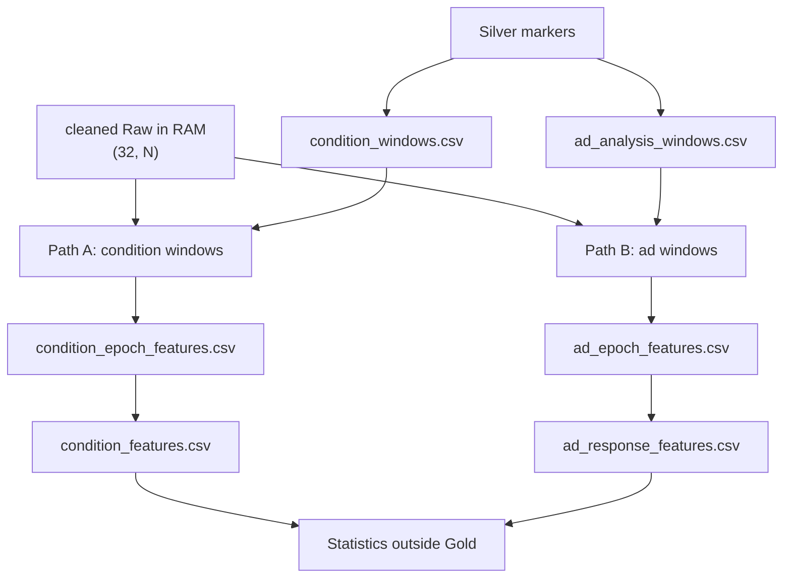

# Gold after cleaning: the two paths, evolving shapes, and ICA

Date: 19 August 2026

## Purpose

This entry explains what Gold actually obtains after Silver has defined
trustworthy time and the cleaning policy. It is the durable record of:

- the two independent Gold paths (condition windows vs ad windows;
  older notes also say sustained condition vs locked advertisement);

- the exact tables each path writes;
- how one participant’s data shape evolves from cleaned `(32, N)` to the
  participant-level numbers that statistics later consume;
- what ICA does and does not change on that path.

It complements `2026-08-04-eeg-preprocessing-how-it-works.md`, which remains
the executable Bronze/Silver/cleaning trace. That document’s older claim that
no ICA decomposition is persisted is outdated: models and review packs live
under `src/project/logs/xdf/silver/ica/candidate_v1/`. Cleaned continuous
`.fif` recordings are still not written.

Walk-through numbers below were measured on the pre-switch tables
(`frozen_v3` no-ICA vs `ica_candidate_v1`). As of 2026-08-19, primary Gold
is the ICA branch (`frozen_v5_ica_primary`); the no-ICA tables are the
sensitivity archive. `lab_subject_3` is the worked example because every
window is eligible and every epoch is retained on both branches, so shape
changes are not confounded by rejection.

## Where Gold starts

Cleaning is lazy. There is no stored cleaned recording. Each Gold feature
builder calls `clean_recording()` in memory from:

- Bronze XDF;
- Silver canonical markers;
- Silver channel-QC table;
- a cleaning policy JSON.

The in-memory product is an MNE `Raw` of shape `(32, N)` in volts at 500 Hz,
plus a `CleaningReport`. The Raw is discarded after features are written.

For `lab_subject_3`:

```text
XDF duration          3442.007 s
MNE regularized span  3441.946 s
N                     1,720,973 samples  (= 3441.946 × 500)
cleaned Raw           (32, 1,720,973)
unit                  volts
```

Cleaning (notch 50 Hz, 0.5–40 Hz, average reference, spline interpolation of
governed bads, optional ICA) never drops a channel or a sample. Sampling rate
is not a third axis. A four-second slice is always `(32, 2000)`.

Gold windows do not need the cleaned matrix. They are timestamp contracts
built from Silver markers. Feature builders later cut those contracts out of
the in-memory Raw.



The two paths share the same cleaned recording and the same 16 spectral
formulas. They do not share windows, epochs, or inferential rows.

## The 16 features computed on every `(32, 2000)` slice

Welch PSD, `nperseg = min(2 × sfreq, n_samples)`, 50 percent overlap, density
scaling. Absolute band power is `10 log10` of the mean µV² integral. Relative
power uses an internal 0.5–40 Hz total that is not exported.

| Feature | What it is |
|---|---|
| `{delta,theta,alpha,beta,gamma}_power_db_uv2` | Global mean across 32 channels |
| `{band}_relative_power` | Same numerator over internal total |
| `fz_theta_power_db_uv2` | Fz only, 4–8 Hz |
| `posterior_alpha_power_db_uv2` | Mean of O1/Oz/O2/P3/Pz/P4, 8–13 Hz |
| `faa_log_f4_minus_f3` | `ln(α_F4) − ln(α_F3)`, not raw F3−F4 |
| `engagement_beta_over_alpha_theta` | Global Pope β / (α+θ) |
| `engagement_pope_frontocentral_beta_over_alpha_theta` | F3/F4/Fz/FC1/FC2/C3/C4/Cz |
| `engagement_kislov_central_beta16_24_over_alpha8_12` | Cz/Pz/P3/P4; 16–24 / 8–12 Hz |

Primary planned contrasts use Fz theta and posterior alpha. The three
engagement indices are exploratory until Person A freezes behaviour.

Epoch rejection (`frozen_v3`): any channel peak-to-peak above 1,050 µV, or any
channel with standard deviation below 0.5 µV.

## Path A — sustained condition windows

Scripts:

- `analysis/eeg/preprocessing/gold/windows/build_condition_windows.py`
- `analysis/eeg/preprocessing/gold/features/build_condition_features.py`

### What is obtained

**1. Time cells, no EEG samples**

`src/project/logs/xdf/gold/windows/condition_windows.csv`

One row per baseline or condition interval:

- baseline: `baseline_start` → `baseline_end`;
- condition: `condition_start` → `condition_conclusion_submitted`.

Generated cohort: 113 rows (18 baselines + 90 eligible conditions + 5
ineligible crowd-protocol conditions for `lab_subject_4_crowdfail`). Feature
builders keep only `primary_analysis_eligible=yes` and
`window_type ∈ {baseline, condition}`, so they read **108 windows**.

Each row is a timestamp contract: subject, condition, ad mode, start/end EEG
offsets, duration, provenance. There is still no `(32, ·)` matrix here.

**2. One spectral row per complete 4 s slice**

`src/project/logs/xdf/gold/features/condition_epoch_features.csv`

Inside each eligible window the builder walks non-overlapping complete
four-second slices. The trailing remainder shorter than 4 s is discarded, not
padded and not overlapped.

```text
window duration D seconds
complete epochs = floor(usable_samples / 2000)
leftover        < 4 s, unused
each epoch      (32, 2000) → 1 CSV row (50 columns)
```

Per epoch the code stores quality metrics, retain/reject, the 16 spectral
features, and `ica_applied`. The voltage matrix is not written.

Primary cohort: **9,468** epoch rows, **9,438** retained (99.7 percent).

**3. One summary row per window**

`src/project/logs/xdf/gold/features/condition_features.csv`

For each window:

- keep retained epochs;
- window eligible if retained count ≥ 5 **and** retained fraction ≥ 0.80;
- each of the 16 features becomes `{feature}_median`, `{feature}_iqr`,
  and `{feature}_mean`;
- primary tests still use `{feature}_median`;
- `{feature}_baseline_delta = condition_median − same-subject baseline_median`;
- `{feature}_mean_baseline_delta` is written the same way from the means.

Baseline deltas are descriptive. In paired condition-versus-condition tests
they cancel algebraically because both sides subtract the same baseline.

Primary table: **108 rows × 73 columns** (18 baselines + 90 conditions).
Statistics later requires exactly those **90 eligible condition rows**.

Path A therefore obtains, for the cohort:

| Object | Shape / count | Meaning |
|---|---|---|
| cleaned Raw (RAM only) | `(32, N)` per person | continuous voltage |
| condition windows | 108 eligible rows | variable-length time cells |
| condition epochs | 9,468 rows | one 4 s spectrum each |
| window summaries | 108 rows | median spectrum per cell |
| inferential input | 90 condition rows | one number per person × condition × feature |

## Path B — locked advertisement pre/post

Scripts:

- `analysis/eeg/preprocessing/gold/windows/build_ad_visibility.py`
- `analysis/eeg/preprocessing/gold/windows/build_ad_windows.py`
- `analysis/eeg/preprocessing/gold/features/build_ad_features.py`

### What is obtained

**1. Visibility / onset provenance**

`ad_visibility_events.csv` records validated visual onsets, or
log-projected `assistant_reply` times for matched no-ad controls, with
combined timing uncertainty. Maximum combined uncertainty in the current
tables is about 0.43 s. That is acceptable for 4 s spectra and not for
millisecond ERP latency.

**2. Locked 4 s cells**

`src/project/logs/xdf/gold/windows/ad_analysis_windows.csv`

Around each eligible onset:

```text
pre:  [onset − 4 s, onset)
post: [onset, onset + 4 s)
```

Both sides must sit inside the parent condition window. There is no leftover
arithmetic: the window **is** the epoch.

Generated: **216 rows** (108 pairs × pre/post). Composition: 144
advertisement rows (72 ads) and 72 matched no-ad rows (36 controls). Every
current row is eligible.

**3. One spectral row per locked window**

`src/project/logs/xdf/gold/features/ad_epoch_features.csv`

Each row is computed from exactly `(32, 2000)`. Same 16 features and the same
1,050 µV / near-flat rule. Primary table: **216 rows**, all retained.

**4. One response row per onset**

`src/project/logs/xdf/gold/features/ad_response_features.csv`

The pre and post rows are joined. For each of the 16 features the table
stores `{feature}_pre`, `{feature}_post`, and `{feature}_post_minus_pre`.
The pair is eligible only if **both** phases were retained.

Primary table: **108 rows × 69 columns**, all eligible. Statistics later
builds four primary Holm-corrected ad-versus-matched-control tests per
feature from these participant-level deltas.

Path B therefore obtains:

| Object | Shape / count | Meaning |
|---|---|---|
| ad windows | 216 rows | fixed 4 s pre or post |
| ad epochs | 216 rows | window equals epoch |
| response pairs | 108 rows | post − pre per onset |
| inferential input | 18 people × 6 onsets | ad vs matched no-ad |

Path B does **not** median-aggregate many epochs. One noisy 4 s slice is the
observation. That is why ICA can move a single ad delta more than it moves a
six-minute condition median.

## Evolving shape for one user: `lab_subject_3`

### Shared start

```text
cleaned no-ICA Raw: (32, 1,720,973)
cleaned ICA Raw:    (32, 1,720,973)   same axes, different voltages
```

Subject 3 has no interpolated channels. The ICA branch fitted 15 components
and excluded component 0 only (`|r|` with Fp1/Fp2 ≈ 0.93, frontal dominance
≈ 1.57). Fourteen components remain mixed back into the same 32 channels.

### Path A, this person

Six eligible windows:

| window_id | condition | duration | complete 4 s epochs | leftover |
|---|---|---:|---:|---:|
| `baseline_00` | baseline | 29.163 s | 7 | 1.163 s |
| `condition_00` | block_late | 360.064 s | 90 | 0.064 s |
| `condition_01` | block_early | 382.578 s | 95 | 2.578 s |
| `condition_02` | inline_late | 431.754 s | 107 | 3.754 s |
| `condition_03` | inline_early | 384.384 s | 96 | 0.384 s |
| `condition_04` | no_ads | 392.871 s | 98 | 0.871 s |

```text
6 variable-length slices from the Raw
  baseline:     (32, 14,581)     ≈ 29.163 × 500
  block_late:   (32, 180,032)
  ...
→ 493 complete epochs of (32, 2000)
→ 493 epoch-feature rows (50 columns)
→ 6 window-summary rows (73 columns)
→ 5 condition medians enter paired tests
```

All 493 epochs are retained on both the no-ICA and ICA branches
(`retained_epoch_fraction = 1.0`, all windows eligible).

Depth on the first baseline epoch (`epoch_index=0`, 13.204–17.204 s):

```text
matrix in RAM:          (32, 2000)
CSV row keeps:          16 spectral numbers + quality, not the matrix

no-ICA  fz_theta        6.602 dB µV²
ICA     fz_theta        4.883 dB µV²
no-ICA  max PTP         345.0 µV on the worst channel
ICA     max PTP         177.2 µV
```

The ICA matrix is still `(32, 2000)`. Removing the blink-like component
lowered peak-to-peak and frontal-midline theta in that slice. Retention did
not change because both PTP values were already far below 1,050 µV.

Window summaries (Fz theta median and its baseline delta):

| window | no-ICA median | ICA median | no-ICA Δ baseline | ICA Δ baseline |
|---|---:|---:|---:|---:|
| baseline | 6.875 | 4.883 | 0 | 0 |
| block_late | 8.909 | 6.300 | +2.034 | +1.417 |
| block_early | 8.583 | 6.098 | +1.709 | +1.215 |
| inline_late | 7.807 | 6.233 | +0.932 | +1.350 |
| inline_early | 8.134 | 6.350 | +1.259 | +1.467 |
| no_ads | 8.335 | 6.232 | +1.460 | +1.350 |

ICA lowered every median, as expected after removing a large frontal
component. It also reordered some condition-versus-baseline gaps:
inline_late’s Fz-theta elevation grew (0.932 → 1.350) while block_late’s
shrank (2.034 → 1.417). The table geometry is identical: still six rows,
still 16 medians, still 16 deltas.

### Path B, this person

Six onsets, twelve locked windows, all inside their parent condition:

| reference_id | kind | parent condition | onset (EEG s) |
|---|---|---|---:|
| `ad_00` | advertisement | block_late | 393.702 |
| `ad_01` | advertisement | block_early | 912.748 |
| `ad_02` | advertisement | inline_late | 1594.776 |
| `ad_03` | advertisement | inline_early | 2028.267 |
| `no_ad_early` | matched reply | no_ads | 2574.929 |
| `no_ad_late` | matched reply | no_ads | 2655.784 |

```text
12 windows × (32, 2000)
→ 12 ad-epoch rows
→ 6 response rows
   each: 16 × (pre, post, post−pre)
```

Worked pair `ad_00` (block_late visual onset at 393.702 s):

```text
pre  [389.702, 393.702)  → (32, 2000) → 16 features
post [393.702, 397.702)  → (32, 2000) → 16 features
response row             → fz_theta_pre, fz_theta_post, fz_theta_post_minus_pre
```

Fz theta post-minus-pre on this person:

| pair | no-ICA Δ | ICA Δ | sign change? |
|---|---:|---:|---|
| ad_00 | −2.162 | −1.962 | no |
| ad_01 | −0.842 | **+2.253** | **yes** |
| ad_02 | −0.321 | −1.928 | no |
| ad_03 | −2.067 | −0.159 | no |
| no_ad_early | −1.077 | **+2.123** | **yes** |
| no_ad_late | −1.940 | +0.405 | **yes** |

Kislov `post_minus_pre` stayed same-signed and similar in magnitude on these
six pairs. Fz theta did not. That is the operational meaning of “ICA changes
values, not shapes”: the CSV still has 12 epoch rows and 6 response rows;
some of the numbers that later become this person’s contrast contribution
can flip sign.

## How ICA changes the Gold objects

ICA is not a third Gold path. It is a different cleaning policy applied
before the same two cutters.

Fit (`ica_candidate_v1`): FastICA, `n_components=0.99`, seed 97, fit 1–40 Hz
with decimation 5, apply to the 0.5–40 Hz cleaned Raw, per subject. Exclude
at most three components that meet **both** max `|r|` with Fp1/Fp2 ≥ 0.35
**and** frontal dominance ≥ 1.5. Human review of `ica_review.html` approved
all automatic exclusions on 2026-08-19.

### Unchanged

- channel count 32, sampling rate 500 Hz, `N` samples;
- every window start/end and every leftover;
- epoch geometry `(32, 2000)`;
- CSV row counts and column names on both Gold paths;
- 16 feature formulas;
- eligibility rules (1,050 µV, near-flat, 80 percent / 5 epochs, both-phase
  ad pairs);
- inferential unit: participant, never epoch.

### Changed

- voltage values inside the same `(32, N)` and `(32, 2000)` arrays;
- `ica_applied` flips from `no` to `yes`;
- quality numbers (peak-to-peak, frontal amplitudes);
- occasionally retain/reject, if ICA moves a slice across 1,050 µV — this
  did not happen for Subject 3;
- every spectral feature and therefore every median, IQR, baseline delta,
  and ad `post_minus_pre`;
- downstream contrast means and, in the current cohort, some ad-test
  significance. Condition corrected-significance agreement is currently
  100 percent; ad corrected agreement is 0.906, with six tests significant
  only under ICA. Do not choose the primary branch in order to keep those
  six findings.

### Persistence

| Object | ICA primary (`frozen_v5`) | no-ICA sensitivity |
|---|---|---|
| cleaned continuous Raw | not written | not written |
| ICA model + figures + JSON | `silver/ica/candidate_v1/` | unused |
| condition/ad Gold tables | `gold/features/*.csv` | `gold/features/sensitivity/no_ica_frozen_v3/` |
| contrast tables | `analysis/eeg/statistics/outputs/` | `outputs/sensitivity/no_ica_frozen_v3/` |

A duplicate ICA copy remains under `gold/features/sensitivity/ica_candidate_v1/`
and must not replace primary. Publication outputs render the ICA branch.

## What Gold is not

- Gold does not persist EEG matrices. After each `(32, 2000)` slice is
  reduced to 16 numbers, the voltages are gone.
- Gold does not test hypotheses. `build_condition_contrasts.py` and
  `build_ad_contrasts.py` sit outside the lake and consume the summary
  tables.
- Baseline deltas on Path A are not a second experiment. They are a
  convenience column.
- Path B’s matched no-ad onsets are log-projected replies, not visual ads.
- Read-versus-write is a third cutter on the same cleaned Raw
  (`build_task_state_windows.py`). It does not change Path A or Path B
  shapes. What it proved: `2026-08-19-read-vs-write-what-it-proved.md`.

## Agent rules

- If asked what Gold produces, name the tables above. Do not describe Gold
  as “cleaned EEG files.”
- If asked for shapes, keep EEG two-dimensional: `(channels, samples)`.
- If asked what ICA changes, say values and provenance, not row counts or
  matrix axes.
- Verify counts against the generated CSVs before quoting them in
  manuscripts. The Subject 3 walk-through is a teaching example, not a
  substitute for the cohort tables.
- Prefer this entry for Gold-path pedagogy; prefer
  `2026-08-04-eeg-preprocessing-how-it-works.md` for the full
  Bronze/Silver/cleaning trace.
