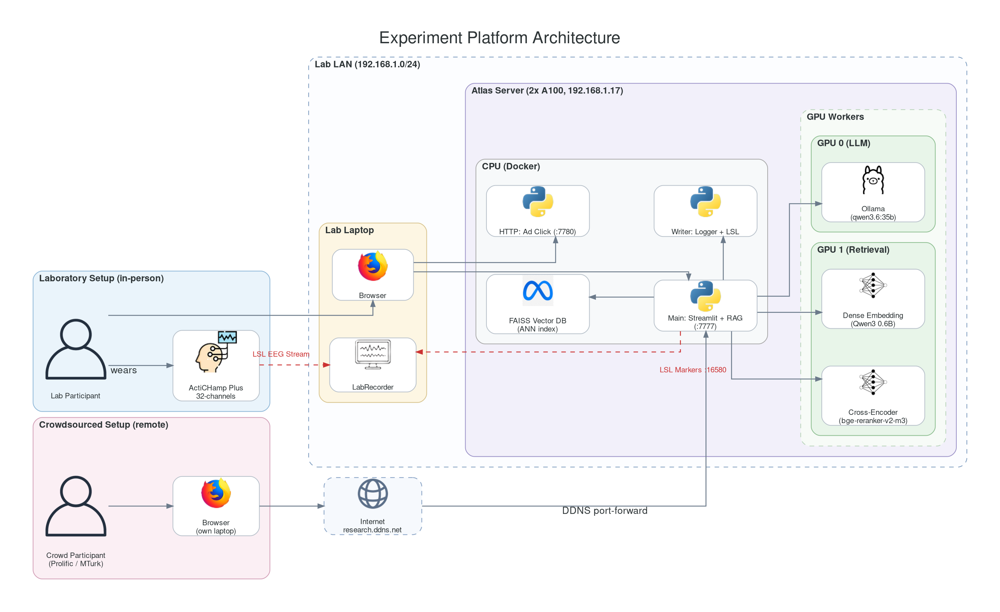
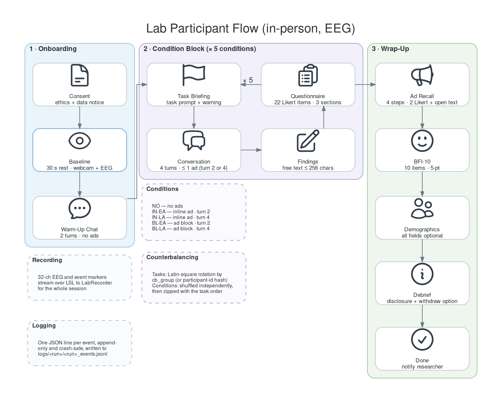

# Conversational Advertising in LLM Assistants

[](#status)
[](VERSION)
[](src/project/requirements.txt)
[](src/project/LICENSE)

Master's thesis with [Telefónica Research](https://www.telefonica.com/en/innovation/telefonica-research/): how does advertising inside an LLM assistant change what users trust, notice, and do?

A Streamlit study platform (local LLM + RAG ads), a five-condition protocol run in an EEG lab and on Prolific, and the confirmatory analyses. Collection is finished.

<p align="center">
  
</p>

<p align="center">
  
</p>

<details>
<summary>Working on this repo with an agent?</summary>

Start at <code><a href="AGENTS.md">AGENTS.md</a></code>, then <code><a href="analysis/README.md">analysis/README.md</a></code>. This README is the public landing page, not the analysis index. Manuscripts live in gitignored Overleaf mirrors under <code>docs/overleaf/</code>.
</details>

## Contents

- [Quick start](#quick-start)
- [Study design](#study-design)
- [Repository](#repository)
- [Data](#data)
- [Documentation](#documentation)
- [Status](#status)
- [License](#license)

## Quick start

Needs one NVIDIA GPU with ≥24 GB VRAM (for example an A100 40 GB).

```bash
cd src/project
cp .env.example .env          # set OLLAMA_BIN to a real binary
./launch.sh --host
```

Open http://localhost:7777. No GPU? `?dev=flow&dry_run=1` walks the whole protocol with the LLM and retrieval mocked.

Backends, cluster mode, and pytest: [platform README](src/project/README.md).

## Study design

Five conditions × one task each, four turns per chat, order counterbalanced. **Implicit** means the product is woven into the reply (not subliminal). **Explicit** is a labelled block above the reply. Log keys stay `inline_*` / `block_*`.

| Paper name | Log / Gold key | Format | Injected at |
|---|---|---|---|
| No ads | `no_ads` | control | — |
| Implicit early | `inline_early` | woven into the reply | turn 2 |
| Implicit late | `inline_late` | woven into the reply | turn 4 |
| Explicit early | `block_early` | labelled block above the reply | turn 2 |
| Explicit late | `block_late` | labelled block above the reply | turn 4 |

Two arms, one codebase: `?study=lab` (rest baseline for EEG) and `?study=crowd` (Prolific ID + attention check). Screen-by-screen protocol: [`workflow_b.md`](src/project/docs/workflow_b.md).

## Repository

| Path | What it is |
|---|---|
| [`src/project/`](src/project/README.md) | Streamlit app, RAG pipeline, protocol, Bronze logs |
| [`analysis/`](analysis/README.md) | Confirmatory analyses (behavioural, EEG, trajectories, combos) |
| [`scripts/`](scripts/) | Promote sessions, LSL bridge, Overleaf sync |
| [`docs/`](docs/README.md) | Overleaf sync notes. Live manuscripts: `docs/overleaf/` (gitignored) |
| [`resources/papers/`](resources/papers/) | Literature corpus (`ADS`, `EEG`, `RAG`, `RecSys`, …) |
| [`AGENTS.md`](AGENTS.md) | Agent / writing router |

## Data

Bronze JSONL: `src/project/logs/tracked/{lab,crowd,beta}/`. Live runs stay in gitignored `logs/production/` until `scripts/sync_tracked.sh`. Confirmatory roster is **N = 54** (18 lab, 36 crowd): drop `synthetic` / `unfinished` / `crowdfail`, keep `unfocused`.

EEG recordings (gitignored): `src/project/logs/xdf/`. Analysis Gold and the reported tables live under [`analysis/`](analysis/README.md), not in the raw JSONL.

## Documentation

| Document | Covers |
|---|---|
| [Platform README](src/project/README.md) | Launch, backends, RAG, logging |
| [Protocol](src/project/docs/workflow_b.md) | Screens, conditions, instruments |
| [Query guide](src/project/docs/query_guide.md) | Session URL parameters |
| [LSL markers](src/project/docs/lsl_marker_protocol.md) | EEG time-locking |
| [Catalog build](src/project/docs/catalog_build.md) | Product index / FAISS |
| [Diagrams](src/project/docs/architecture/README.md) | Generated figures |
| [Thesis docs](docs/README.md) | Overleaf mirrors |

Read-only Overleaf views: [thesis](https://www.overleaf.com/read/jmpfyvkdxcnt#deeda3) · [presentation](https://www.overleaf.com/read/tvwscngdpyfp#e86fdc) · [paper](https://www.overleaf.com/read/tcggxdnhjgmm#739137). Source of truth is `docs/overleaf/`.

Every session stamps the root [`VERSION`](VERSION) file (`2.2.0`) into `experiment_config`. Older exports may say `1.1.0-pilot1` or `unknown` — treat those as pilot 1.

## Status

Collection and confirmatory analyses are done. Manuscript write-up is in progress (thesis deadline 17 September 2026).

<details>
<summary>Background reading</summary>

Local corpus: [`resources/`](resources/) (`papers/`, `blogs/`, `books/`).
Paper clusters: `ADS`, `CRS`, `EEG`, `Economics`, `IMPORTANT`, `LLM`, `RAG`, `RecSys`, `RL`.

Industry / lists (not on disk): [ACM RecSys](https://www.youtube.com/@acmrecsys/playlists) · [Awesome RecSys](https://github.com/jihoo-kim/awesome-RecSys) · [LLM4Rec](https://github.com/WLiK/LLM4Rec-Awesome-Papers) · [OpenAI ads](https://www.youtube.com/watch?v=2agJo3Jf_O4&t=1233s) · [Agentic Commerce](https://developers.openai.com/commerce) · [Thrad](https://www.thrad.ai/)
</details>

## License

Apache-2.0 — [src/project/LICENSE](src/project/LICENSE).
