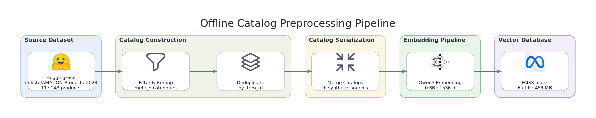

# Catalog Build

Rebuilds the product catalog and the FAISS index that the ad-retrieval pipeline
searches. Run this once per machine; the artifacts are large and git-ignored.



## Prerequisites

Run from `src/project` with the project requirements installed (`datasets`,
`faiss-cpu`, `sentence-transformers`, `rank-bm25`, `loguru`). Embedding 100k+
items is much faster with a GPU visible.

## Command

```bash
python scripts/prepare_amazon_catalog.py \
  --force-ingest --build-index --streaming \
  --category \
    meta_Amazon_Fashion meta_Appliances meta_Arts_Crafts_and_Sewing meta_Automotive \
    meta_Baby_Products meta_Beauty_and_Personal_Care meta_Books meta_CDs_and_Vinyl \
    meta_Cell_Phones_and_Accessories meta_Clothing_Shoes_and_Jewelry meta_Digital_Music \
    meta_Electronics meta_Gift_Cards meta_Grocery_and_Gourmet_Food meta_Handmade_Products \
    meta_Health_and_Household meta_Health_and_Personal_Care meta_Home_and_Kitchen \
    meta_Industrial_and_Scientific meta_Magazine_Subscriptions meta_Musical_Instruments \
    meta_Office_Products meta_Patio_Lawn_and_Garden meta_Pet_Supplies meta_Software \
    meta_Sports_and_Outdoors meta_Tools_and_Home_Improvement meta_Toys_and_Games \
    meta_Unknown meta_Video_Games
```

Useful flags: `--max-items N` to cap items per category while testing,
`--append` to add categories to an existing catalog, `--catalog-dir` and
`--index-path` to relocate the outputs.

## Output

| Artifact | Contents |
|---|---|
| `data/catalogs/amazon.jsonl` | Raw per-category items as ingested |
| `data/catalogs/catalog.jsonl` | Merged, normalised, deduplicated catalog (~117k items) |
| `data/faiss.index` | `IndexFlatIP` over the catalog embeddings |

Expect a few hundred MB per file. Because `catalog.jsonl` is already normalised,
keep `CATALOG_ADAPTER=generic`; the `amazon` adapter is only for raw Amazon
JSONL with `parent_asin` fields.

## Category filtering at retrieval time

Each `TaskDefinition` in `core/experiment/tasks.py` declares
`relevant_categories`. At runtime the `HybridRefiner` keeps only candidates
whose `metadata.filename` matches the current task's categories, so a gardening
task cannot surface laptops.

The `pool_size` field logged on `condition_started`,
`condition_conclusion_submitted`, `condition_complete`, and
`conversation_completed` records how many catalog items were eligible for that
task — worth checking when a condition produces weak ads.
