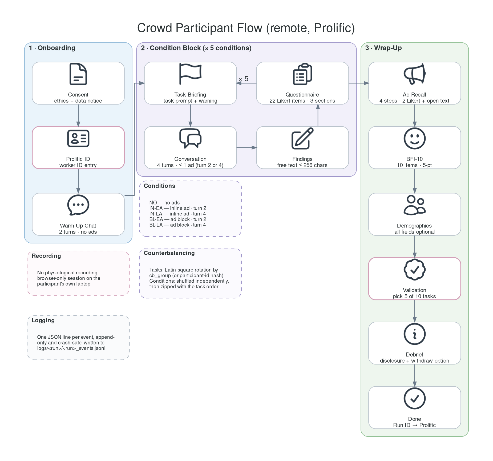

# Experimental Protocol (Workflow B)

Five-condition within-subject design measuring how ad **format** and **timing**
affect trust, intrusiveness, and behaviour in an LLM shopping assistant. The
consent screen quotes 30–60 minutes per session.

Implemented by `core/experiment/controller.py`; all constants live in
`core/config.py`.

---

## Conditions

| Condition | Label | Ad format | Injector | Ad turn |
|---|---|---|---|---|
| `no_ads` | NO | none (control) | — | — |
| `inline_early` | IN-EA | implicit: woven into the reply | `inline_persuasive` | 2 |
| `inline_late` | IN-LA | implicit: woven into the reply | `inline_persuasive` | 4 |
| `block_early` | BL-EA | explicit: labelled unit above the reply | `explicit_ad_block` | 2 |
| `block_late` | BL-LA | explicit: labelled unit above the reply | `explicit_ad_block` | 4 |

Each ad condition injects **exactly one ad**; `no_ads` never injects. The
product is retrieved live from the catalog and filtered to the categories
declared by that trial's task.

## Screen sequence

```text
consent → [baseline | prolific_id] → warmup_chat
  → [ condition_intro → condition_chat → condition_conclusion
      → post_condition_survey ] × 5
  → ads_recall_interpretation → ocean → demographics
  → [validation] → deception_disclosure → done
```

Both arms run the same state machine and differ only by skipped screens
(`STUDY_SKIP_SCREENS`):

| Arm | Extra screens | Skipped |
|---|---|---|
| `lab` | 30 s eye-tracking/EEG baseline | `prolific_id`, `validation` |
| `crowd` | Prolific ID entry, task-recognition validation | `baseline` |



### What each screen collects

| Screen | Content |
|---|---|
| `consent` | Study information and agreement |
| `baseline` | 30 s rest for EEG/eye-tracking calibration (lab) |
| `prolific_id` | Worker ID, logged as `worker_id_set` (crowd) |
| `warmup_chat` | 2-turn casual chat, no ads, not logged as a condition |
| `condition_intro` | Task briefing plus the independent-conversation warning |
| `condition_chat` | 4-turn conversation; at most one ad |
| `condition_conclusion` | Free-text findings, ≤ 256 characters |
| `post_condition_survey` | 22 rated items on a 7-point scale, three sections |
| `ads_recall_interpretation` | One step per ad condition (4 steps): the ad is shown again, then 2 rated items and one open response |
| `ocean` | BFI-10, 10 items, 5-point |
| `demographics` | 2 free-text and 4 select items |
| `validation` | Pick the 5 tasks actually completed out of 10; ≥ 2 mistakes flags the session (crowd) |
| `deception_disclosure` | Debrief, disclosure, and opt-out |

The post-condition questionnaire combines 15 assistant-evaluation items, 3
personality-related Likert items, 2 items that are both rated and elaborated in
free text, and 2 behavioural items.

## Counterbalancing

- **Tasks.** The first five entries of `TASK_CATALOG` are rotated Latin-square
  style. The row is `?cb=N` when given, otherwise `hash(participant_id)`.
- **Conditions.** Shuffled independently, then zipped with the rotated tasks, so
  condition and task are not confounded across participants.
- **Reproducibility.** `?seed=N` makes the condition shuffle and the ad-turn draw
  deterministic. The realised assignment does not need reconstructing: the whole
  condition plan is written into the `session_started` event.

## Turn structure

Conversations are fixed at 4 user turns (`MIN_TURNS_PER_TRIAL` and
`MAX_TURNS_PER_TRIAL`). The "I've finished" button appears from the turn given
by `FINISH_BUTTON_VISIBLE_FROM_TURN`, which defaults to the minimum. A
participant who has completed at least `EXIT_N_TRIALS` (5) conditions can leave
early from the sidebar and still contribute a usable session.

## Logged data

Per session, in JSONL:

- `session_started` — participant, study type, and the full condition plan
- `experiment_config` — build version, LLM settings, active retrieval stages
- `condition_start` / `condition_end` — condition, ad mode, planned ad turn
- `user_message`, `assistant_reply`, `intent_classified`, `retrieval`
- `ad_injected`, `ad_displayed`, `ad_clicked`
- `turn_N_read` / `turn_N_write` — reading and writing onsets for time-locking
- `condition_conclusion_submitted`, `post_condition_survey_submitted`
- `ads_recall_submitted`, `ocean_submitted`, `demographics_post_submitted`,
  `validation_submitted`, `deception_disclosure_submitted`
- `session_complete` — the aggregated session record

See the [platform README](../README.md#logging) for file layout, and
[`lsl_marker_protocol.md`](lsl_marker_protocol.md) for the EEG marker stream.

## Dev modes

| URL | Purpose |
|---|---|
| `?dev=true` | Free-form chat with condition, ad, and task selectors |
| `?dev=flow` | The participant flow plus skip buttons, overrides, debug panels |
| `?dev=flow&dry_run=1` | Same, with the LLM and retrieval mocked |

Full parameter reference: [`query_guide.md`](query_guide.md).
